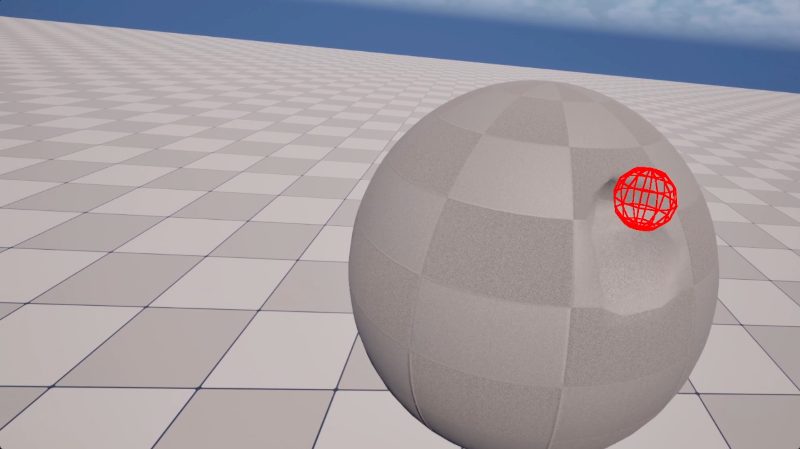
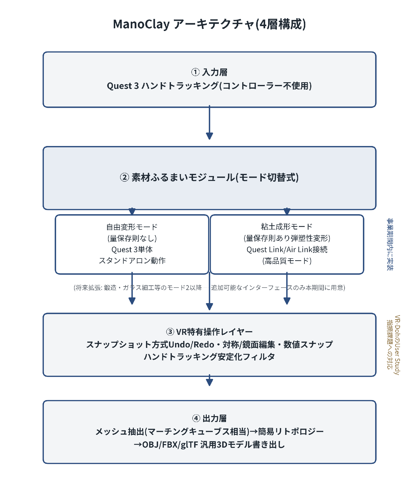

# ManoClay Prototype

**素手で粘土をこねる MR 3D モデリング「ManoClay」の技術検証プロトタイプ**

Meta Quest 3 のハンドトラッキングで取得した指先の位置を使い、仮想空間の粘土オブジェクトをリアルタイムに変形させます。このリポジトリは、2026 年度下期 未踏アドバンスト事業への提案「ManoClay」の実現性を裏付ける、契約前の試作コードです。



*契約前試作の動作画面（2026 年 9 月）。赤いワイヤーフレームは、Quest 3 実機のハンドトラッキングで取得した右手人差し指先端の位置です。触れた部分の粘土表面が局所的にへこんでいます。Quest Link 接続時の UE5 エディタ内 VR プレビューで検証しました。*

---

## ManoClay の目標

ManoClay は、次の 3 つの条件を満たす 3D モデリングツールを目指しています。

- **コントローラーを使わない**：Quest 3 のハンドトラッキングだけで、素手で粘土に触れて形を作る
- **Quest 3 単体で動く**：自由変形モードは PC なしのスタンドアロンで動作させる
- **3D モデルとして書き出せる**：造形結果を OBJ / FBX / glTF として出力し、他の制作に使えるようにする

## 現在の到達点（2026 年 9 月時点）

| 項目 | 状態 |
|---|---|
| Quest 3 のハンドトラッキング入力（右手人差し指先端）を C++ で取得 | ✅ 検証済み |
| 動的メッシュによる粘土オブジェクトの生成 | ✅ 検証済み |
| 指先周辺の頂点を動かす自由変形（量保存則なし） | ✅ 検証済み |
| 変形後の法線再計算とリアルタイム表示 | ✅ 検証済み |
| Quest Link 接続時の UE5 エディタ内 VR プレビューでの動作 | ✅ 検証済み（体感・目視では遅延なく追従） |
| fps の数値計測 | ⬜ 未実施（事業期間フェーズ 1 で計測の仕組みを作る） |
| Quest 3 単体（スタンドアロン）での動作 | ⬜ 未実施（フェーズ 1 で移植） |
| 量保存則を伴う粘土成形モード（局所シミュレーション） | ⬜ 未着手（フェーズ 2） |
| Undo/Redo・対称編集・安定化フィルタ | ⬜ 未着手（フェーズ 3） |
| メッシュ書き出し（OBJ / FBX / glTF） | ⬜ 未着手（フェーズ 4） |

## 実装の概要

### 処理の流れ（毎フレーム）

```
Quest 3 ハンドトラッキング
   │ IHandTracker::GetKeypointState(Right, IndexTip)
   ▼
AHandTrackerPawn::Tick
   │ 指先位置に赤いデバッグ球（半径 2cm）を描く
   │ 指先位置を渡す（変形半径 4cm、押し込み量 1cm）
   ▼
AClayActor::DeformClayAtLocation
   │ ① ワールド座標をアクターのローカル座標に変換
   │ ② AABB で候補の頂点を大まかに絞り込む
   │ ③ 球の内側にある頂点を、指先から遠ざかる向きに動かす
   │    （中心に近いほど大きく動くよう、コサインカーブで減衰）
   │ ④ 法線を再計算し、メッシュの更新を通知する
   ▼
UDynamicMeshComponent で描画
```

### 主なソースファイル

| ファイル | 役割 |
|---|---|
| [`Source/testMeta3/HandTrackerPawn.cpp`](Source/testMeta3/HandTrackerPawn.cpp) | UE5 の低レイヤー API `IHandTracker`（ModularFeature 経由）で、右手人差し指先端の位置を毎フレーム取得する。取得した位置を粘土アクターに渡す。 |
| [`Source/testMeta3/ClayActor.cpp`](Source/testMeta3/ClayActor.cpp) | `FSphereGenerator` で半径 20cm・48×48 分割（約 2,300 頂点）の球を `FDynamicMesh3` として作る。指先周辺の頂点を動かしたあと、法線を再計算する。 |
| [`Source/testMeta3/testMeta3.Build.cs`](Source/testMeta3/testMeta3.Build.cs) | 依存モジュール：`GeometryFramework` / `GeometryCore` / `GeometryAlgorithms` / `DynamicMesh` / `GeometryScriptingCore` / `HeadMountedDisplay` |

### 変形の式

変形半径を $r$、指先から頂点までの距離を $d$ とします（$d < r$）。

$$
t = 1 - \frac{d}{r}, \qquad w = \frac{1 - \cos(\pi t)}{2}, \qquad \Delta\mathbf{p} = s \cdot w \cdot \frac{\mathbf{p} - \mathbf{c}}{\lVert \mathbf{p} - \mathbf{c} \rVert}
$$

- $\mathbf{c}$：指先の位置
- $\mathbf{p}$：頂点の位置
- $s$：押し込み量（現在は 1cm/フレーム）

$w$ は、境界（$d = r$）でも中心（$d = 0$）でも傾きが 0 になる、なめらかな重みです。そのため、へこみの縁に段差ができません。

## 動作環境

| 項目 | 内容 |
|---|---|
| エンジン | Unreal Engine 5.8（C++ プロジェクト） |
| デバイス | Meta Quest 3（ハンドトラッキング有効） |
| 接続 | Quest Link / Air Link（現時点では PC 経由の VR プレビュー） |
| 有効化プラグイン | OpenXR / OpenXRHandTracking / OpenXREyeTracker / ModelingToolsEditorMode |
| 開発環境 | Windows 11、Visual Studio 2022 以降（「C++ によるゲーム開発」ワークロード） |

## ビルドと実行

1. このリポジトリをクローンします。
2. `testMeta3.uproject` を右クリックし、**Generate Visual Studio project files** を実行します。
3. 生成された `testMeta3.sln` を開き、`Development Editor` / `Win64` でビルドします。
4. Quest 3 を Quest Link または Air Link で PC に接続し、ハンドトラッキングを有効にします（コントローラーは置いておきます）。
5. UE5 エディタで `testMeta3.uproject` を開きます。既定マップは `VR_TestMap` です。
6. **VR プレビュー**で実行し、右手の人差し指で球に触れると表面がへこみます。

## ディレクトリ構成

```
.
├── Config/                 # プロジェクト設定（既定マップ、レンダリング、入力）
├── Content/                # マップ（VR_TestMap ほか）と XR テンプレート素材
├── Source/testMeta3/       # C++ 実装（ハンドトラッキング入力、粘土の変形）
├── docs/images/            # README 用の画像
└── testMeta3.uproject
```

`Content/` 配下の `XRFramework/`、`XRMannequins/`、`Weapons/`、`LevelPrototyping/` などは、UE5 の VR テンプレートに同梱されている素材です。

## 今後の開発計画（事業期間 2027/1/15〜2027/9/16）



| フェーズ | 時期 | 内容 |
|---|---|---|
| 0 | 契約前〜1 月 | 造形技法ごとに物理則を切り替えられる「素材ふるまいモジュール」のインターフェースを設計する |
| 1 | 1 月中旬〜2 月 | 本試作を Quest 3 単体のスタンドアロン環境へ移植し、fps と粒子数を実機で計測する仕組みを作る |
| 2 | 3〜4 月 | 手の近くに限定した局所シミュレーション（粒子数 1 万オーダーを暫定目標）とマーチングキューブス相当のメッシュ化で、粘土成形モードを実装する |
| 3 | 5 月 | スナップショット方式の Undo/Redo、トラッキング安定化フィルタ、対称・鏡面編集、操作感度の適応調整を実装する |
| 4 | 6 月 | 簡易リトポロジーと、OBJ / FBX / glTF 書き出しを実装する |
| 5 | 7〜8 月 | 統合とクローズドテストを行い、Meta Horizon Store で Early Access 公開する |
| 6 | 9 月前半 | 成果報告書を作成する |

## 関連する先行研究

- **VR-Doh**（arXiv:2412.00814）：素手のハンドトラッキングで、量保存則を伴う塑性変形を実現した研究。PCVR（RTX 4090）構成で、3D Gaussian Splatting による表示。
- **PotteryVR**（2022）：VR 空間でのろくろ成形と、OBJ / STL 出力を組み合わせた研究プロトタイプ。

ManoClay の新規性は、個々の要素技術そのものではありません。次の条件を**一般消費者向けの単一製品としてすべて同時に満たす**点にあります。

- 専用機材が不要
- Quest 3 のハンドトラッキングだけで操作できる
- 単一の商用エンジンで実装する
- 複数の造形技法をモードとして統合する
- 実用可能な 3D モデルとして書き出せる
